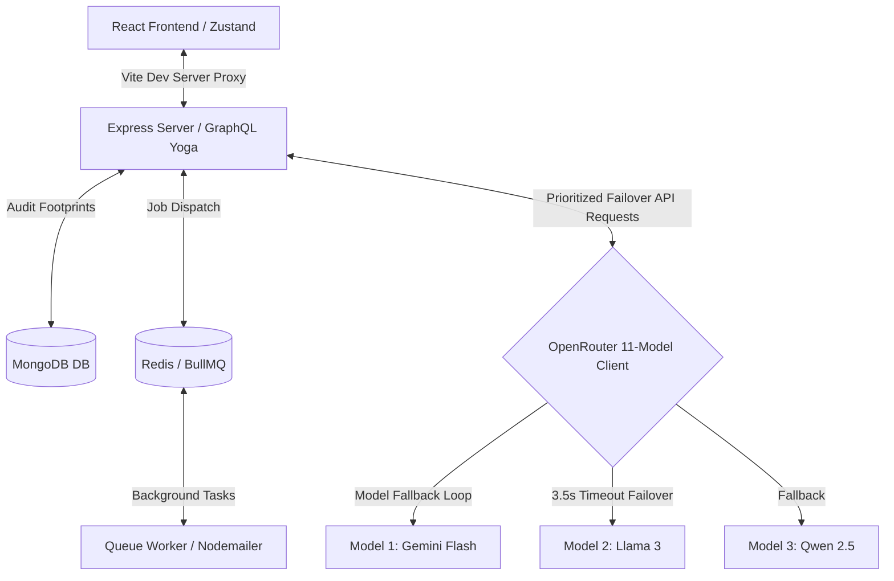

# AI Hospital Agent System (POH)

An enterprise-grade, secure clinical automation and physician assistant platform. Built with a high-performance React frontend, Express/GraphQL Yoga backend, and an intelligent **Planner-Worker Multi-Agent Orchestration** framework powered by 11-model OpenRouter failovers.

---

## 🏗️ System Architecture



---

## 🛡️ Enterprise Security Hardening

To comply with **HIPAA** and **SOC2 Type II** security requirements, the platform enforces five layers of defense:

1. **In-Memory JWT Access Token Storage**
   * The short-lived `accessToken` is stored in the frontend's local closure memory (`inMemoryAccessToken`).
   * No access tokens are ever written to `localStorage` or `sessionStorage`, making the client **100% immune to Cross-Site Scripting (XSS)** token theft.
   
2. **Secure HTTP-Only Cookies via Vite Proxy**
   * The `refreshToken` is set by the backend server in the `Set-Cookie` response headers with `HttpOnly`, `Secure`, and `SameSite=Strict` flags.
   * Browser-side JavaScript cannot read the cookie, neutralizing token extraction exploits.
   * **Local Development Proxying**: To prevent browser port-mismatch blocks on `localhost` (e.g. frontend on `3000` vs backend on `4000`), a local proxy is configured in Vite. This routes `/graphql` requests through port `3000`, making the cookies same-site and ensuring secure, persistent session restoration on tab reload.

3. **Session Hijacking Fingerprint Validation**
   * The database stores the client's **IP Address** and browser **User-Agent Fingerprint** alongside active session records.
   * If a `refreshToken` call comes from a different IP or device, the backend immediately treats it as a security breach: it purges all active sessions for that user and rejects the token.

4. **HIPAA Chart Access Log Auditing**
   * Every clinical chart read query (e.g., `patientProfile`) logs a HIPAA compliance footprint containing the accessing clinician's ID, accessed patient ID, IP address, and request ID.

5. **Production GraphQL Introspection Shield**
   * In production (`NODE_ENV === 'production'`), Express intercepts incoming schema queries (`__schema` or `__type`) and blocks them, preventing attackers from mapping out schema database models.

---

## 🤖 AI Orchestration: Planner-Worker Multi-Agent Pattern

The application handles clinical requests using a distributed agent pipeline:

* **Intent Routing (PlannerAgent)**:
  * When a clinician asks a question, the `PlannerAgent` classifies user intent into one of five categories: `APPOINTMENT`, `LAB_REPORT`, `BILLING`, `DOCTOR_ASSISTANT`, or `INVALID`.
  * Classified queries are routed to specialized worker agents (e.g., `DoctorAssistantAgent`, `BillingAgent`, etc.).
  
* **ChatGPT-Style Regex Synonym Mapping**:
  * If the LLM provider is offline, the routing falls back automatically to an optimized regex classification matcher.

* **Non-Clinical Fallback Boundary**:
  * Any queries determined to be non-clinical (general discussion, coding questions, chit-chat) are intercepted at the boundary, returning a helpful medical assistant disclaimer.

* **11-Model Prioritized OpenRouter Failover Client**:
  * Requests are made using a prioritized failover chain across **11 OpenRouter free models**.
  * A 3.5-second `AbortController` timer monitors every request. If a model times out or errors, the provider instantly rotates to the next model in line:
    1. `google/gemini-2.5-flash:free` (Primary)
    2. `meta-llama/llama-3.3-70b-instruct:free`
    3. `qwen/qwen-2.5-72b-instruct:free`
    4. *...and 8 other fallback models*

---

## 💻 Tech Stack

### Frontend (Client)
* **Core**: React 18, TypeScript, Tailwind CSS
* **Routing**: React Router
* **State Management**: Zustand
* **Animations**: Framer Motion
* **API Connection**: Axios (configured with `withCredentials: true` and automatic `401` refresh interceptors)

### Backend (Server)
* **Runtime**: Node.js 22 (ESM)
* **Server Framework**: Express, GraphQL Yoga
* **Database**: MongoDB (via Mongoose)
* **Job Queuing**: Redis + BullMQ
* **Logging**: Pino + Thread Local Request Tracing

---

## 🚀 Setup & Run Instructions

### Prerequisites
* **Node.js**: v20 or later (v22 recommended)
* **MongoDB**: Running instance (Local or Atlas)
* **Redis**: Running instance (Local or Cloud)

### Environment Variables

#### Backend (`Backend/.env`)
```ini
PORT=4000
NODE_ENV=development
MONGO_URI=mongodb://localhost:27017/ai-hospital
REDIS_HOST=localhost
REDIS_PORT=6379
JWT_SECRET=super-secure-jwt-secret-key-123
JWT_REFRESH_SECRET=super-secure-jwt-refresh-secret-key-567
OPENROUTER_API_KEY=your-openrouter-key-here
```

#### Frontend (`Frontend/.env`)
```ini
VITE_API_URL=/graphql
```

### Installation

1. Install dependencies in both folders:
   ```bash
   # Install Backend
   cd Backend
   npm install

   # Install Frontend
   cd ../Frontend
   npm install
   ```

2. Compile and Start Backend:
   ```bash
   cd Backend
   npm run build
   npm start
   ```

3. Run Frontend Dev Server:
   ```bash
   cd Frontend
   npm run dev
   ```

### Running Test Suite
Execute the integration test suite in the Backend directory:
```bash
cd Backend
npm run test
```
All 26 Jest integration tests verify GraphQL queries, authentication logic, token rotation, upload features, and worker dispatches.
